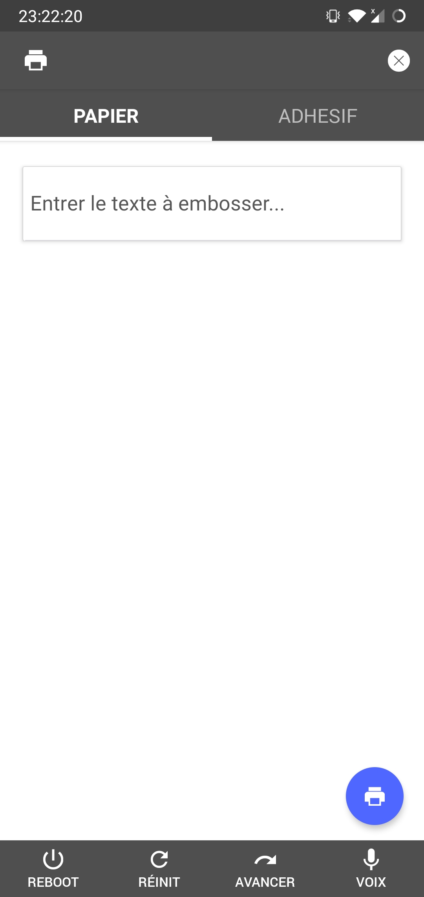
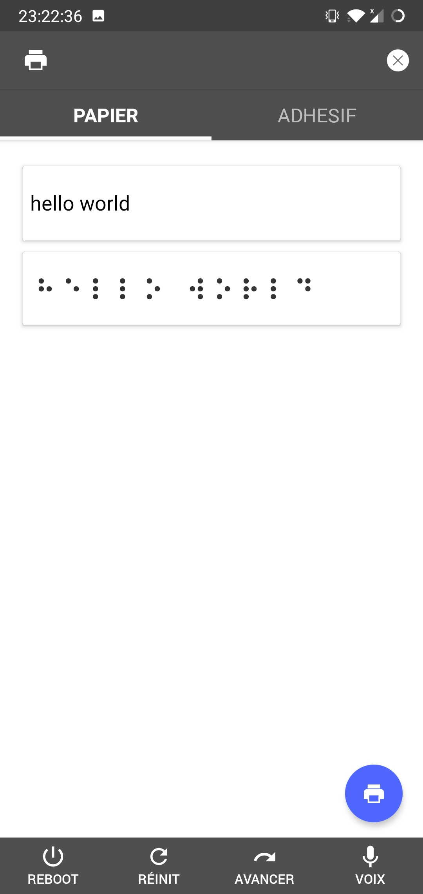

<p align="center">
 
</p>

## Preview

<p align="center">
 
 
</p>

## [Read the documentation (FR)](./documentation.pdf)

<p align="center">
 
</p>

## Project tree

```
|-- braille-embosser
    |-- App                   <-- Pure React Native App
    |   |-- App.js
    |   |-- app.json
    |   |-- index.js
    |   |-- package.json
    |   |-- assets
    |-- Server                <-- Node server (Raspberry Pi)
    |   |-- package.json
    |   |-- server.js         <-- Server main file
    |   |-- data
    |       |-- braille.json  <-- Braille alphabet
    |       |-- status.json   <-- Status messages
    |-- Website               <-- React website (alternative to the App)

```

## Installing

### Prerequisites
* Have [Node.js](https://nodejs.org/en/) installed (> 8)
* Download [Android Studio](https://developer.android.com/studio/index.html) for AVD. (See [React Native Documentation](https://facebook.github.io/react-native/docs/getting-started.html) for further informations)
  
### Steps

* `git clone https://github.com/KeziahMoselle/braille-embosser.git`
* Launch the Server :
  * `cd Server`
  * `npm install`
  * `node server`
* Launch the App :
  * Launch AVD or plug your smartphone and enable : `USB debugging` in `Developper options`
  * `cd App`
  * `npm install`
  * `react-native run-android`
* Launch the Website : 
  * `cd Website`
  * `npm run start`

## Features

  * **Application**
    * [x] Send text via WebSocket to the Raspberry Pi
    * [x] Communication between the App and the Raspberry Pi via Wi-Fi
    * ~~Voice recognition.~~
    * ~~NFC.~~
  * **Server**
    * [x] Web Server
    * [x] Encode user input in Braille code.
    * [x] Send the braille code the microcontroller.
    * [x] Error / Success handler
